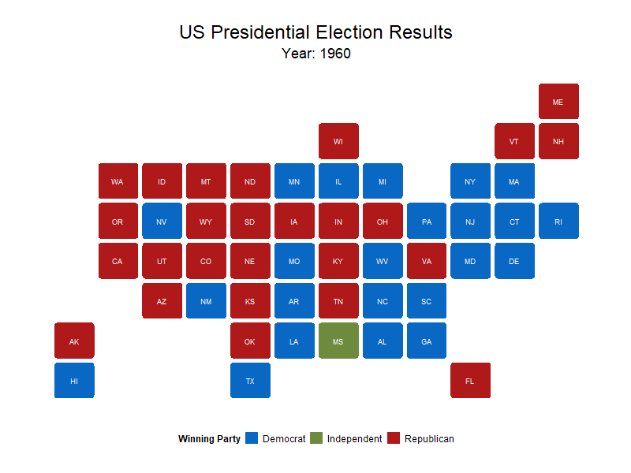
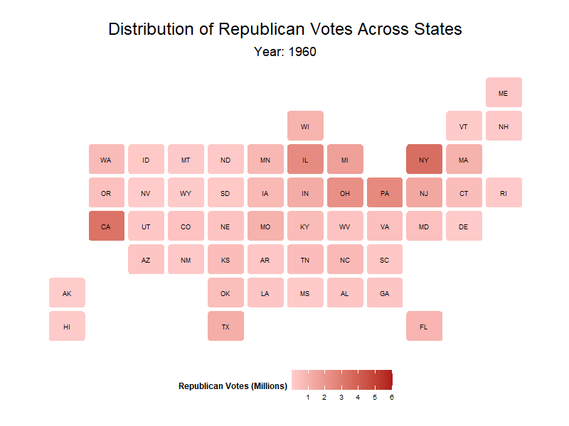
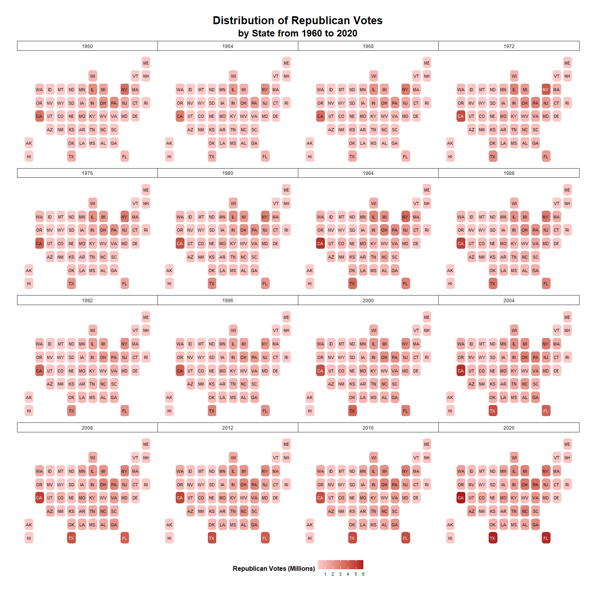
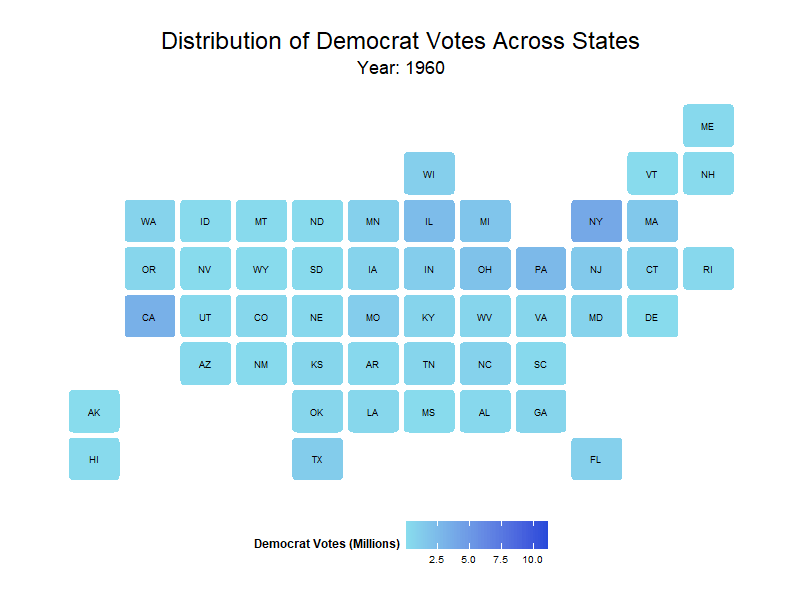
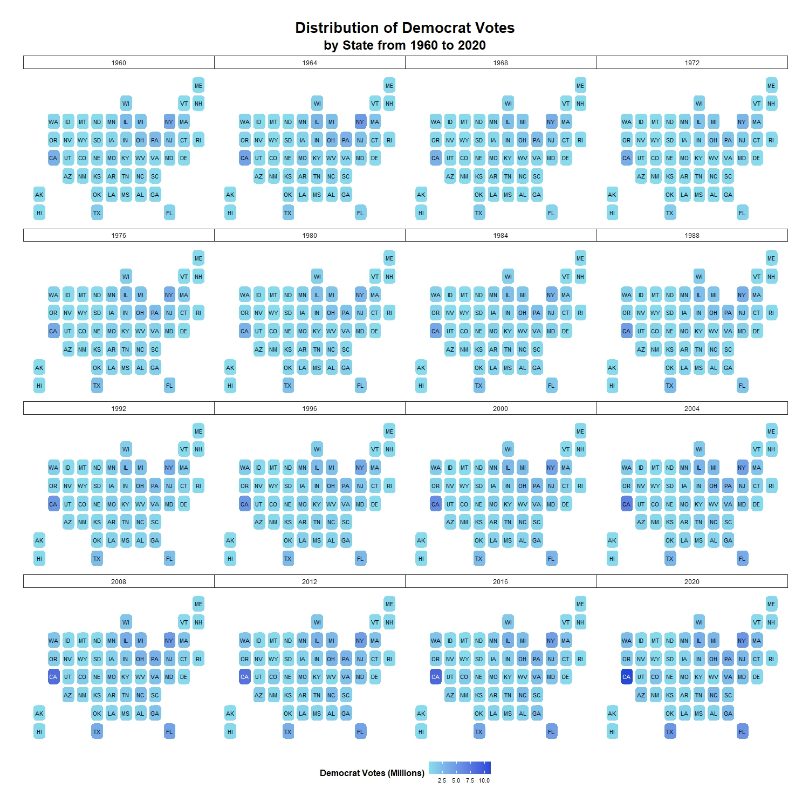

**Timelapse of the US Presidential Elections from 1960 to 2020**

---

The US Presidential Election is the world's most significant and widely watched election. It is so significant that the outcome of selecting a president in the presidential election can affect the global economy and geopolitics. 

Former President Donald Trump election victory in 2016 saw him and adminstration clashing with foreign partners and enemies from geopolitics to trade to international agreements.

This page aims to show an animation of the US Presidential Election results, share of republican and democrat voters from 1960 to 2020. Lastly a facet grid view of the election results and share of republican and democrat voters will be shown.  

----

**Facet frid of US President Election Results from 1960 to 2020**

---

**Distribution of Republican Voters across States from 1960 to 2020**

----

**Facet grid of Republican Voters across State from 1960 to 2020**

----

**Distribution of Democrat Voters across States from 1960 to 2020**

----

**Facet grid of Democrat Voters across State from 1960 to 2020**

